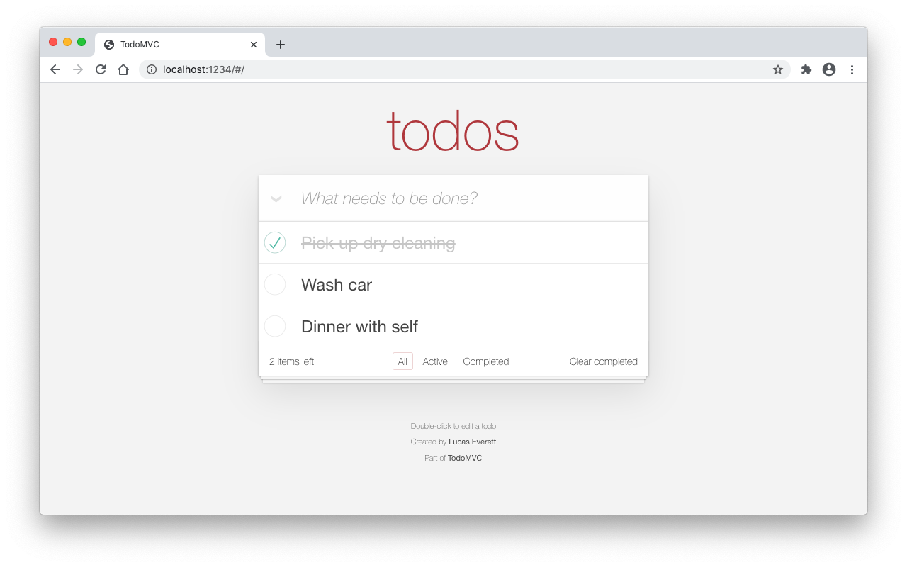

<div style="text-align:center"></div>

# TodoMVC (Solid)

This is a port of [TodoMVC](http://todomvc.com/) using [Solid](https://www.solidjs.com/). All functionality from TodoMVC has been implemented using the [application specifications](https://github.com/tastejs/todomvc/blob/master/app-spec.md).

## Live Demo

https://apps.lucaseverett.dev/todomvc-solid/

## Getting Started

Clone this repo:

```sh
git clone https://github.com/lucaseverett/todomvc-solid.git
```

Install NPM dependencies:

```sh
npm install
```

Start dev server:

```sh
npm start
```

## Related Projects

[TodoMVC (React)](https://github.com/lucaseverett/todomvc-react)
